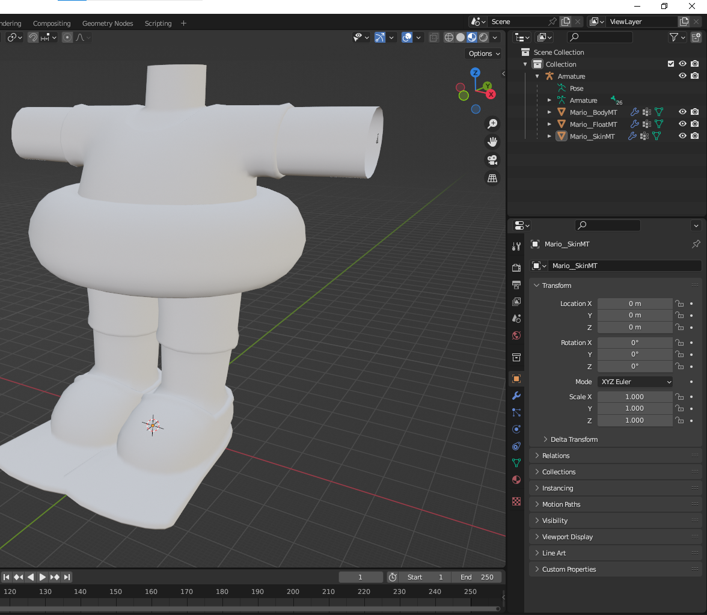
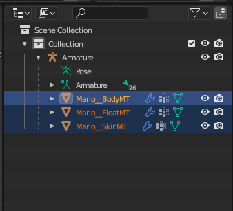
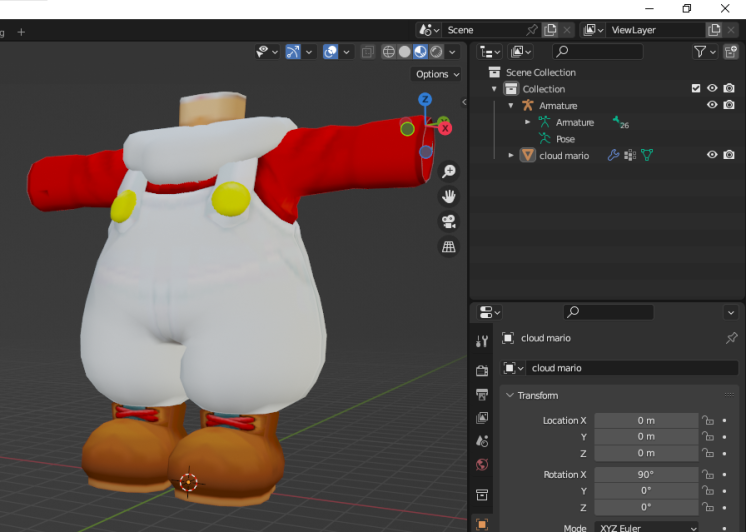
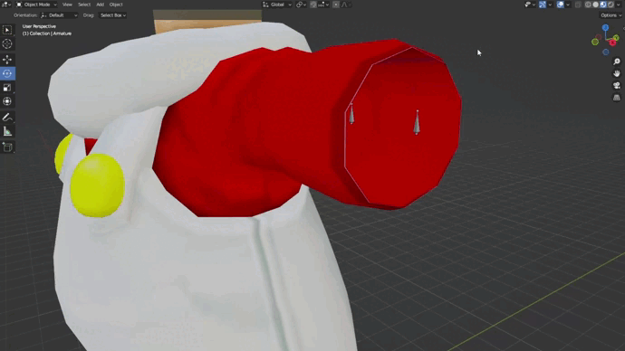
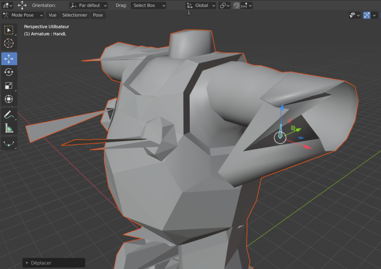
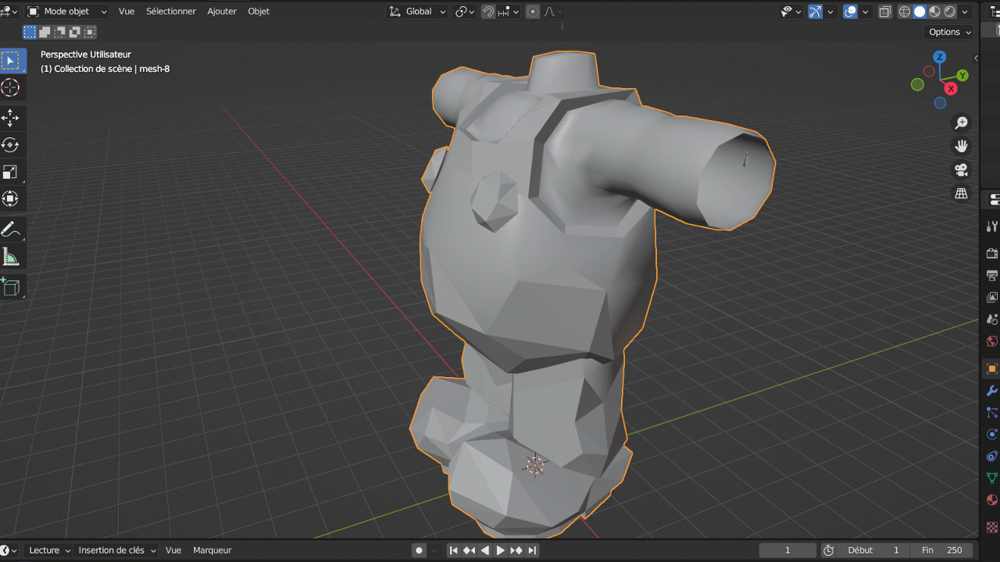

# replace skin model guide

### Step 1 : Import the model for the outfit you want to replace.

### Step 2 : Delete anything in this list with the orange triangle to the left of it

### Step 3 : Import your custom model
*Make sure to drag and drop the custom model into the list under "armature". To do this, drag the custom model over armature while holding shift, then drop it*

### Step 4 : Select the model and the skeleton in that order, then right click and go to Parent --> with automatic weights

# If it doesn't works
### in pose mode when you try to move the bones you can see that it looks like this (it's a bit weird):

### select the model and go into "Edit Mode". From there hit the A key and M key, then click "By Distance" :

Then try to repeat step 4. If it still doesn't work, you will have to do the weight painting yourself, you can find some tutorials on youtube like this one: [weight painting tutorial](https://www.youtube.com/watch?v=4fICQmBEt4Y&ab_channel=RoyalSkies)