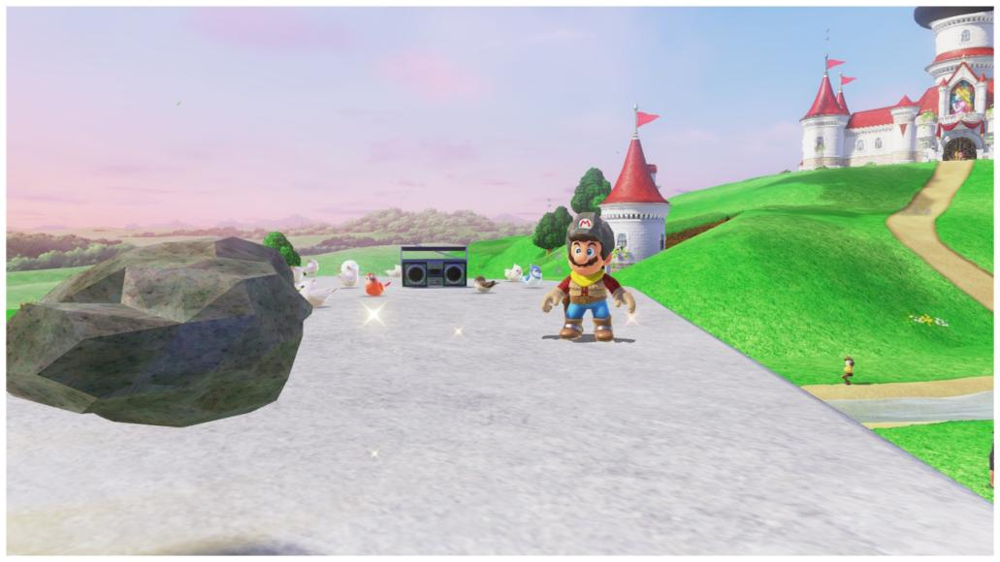
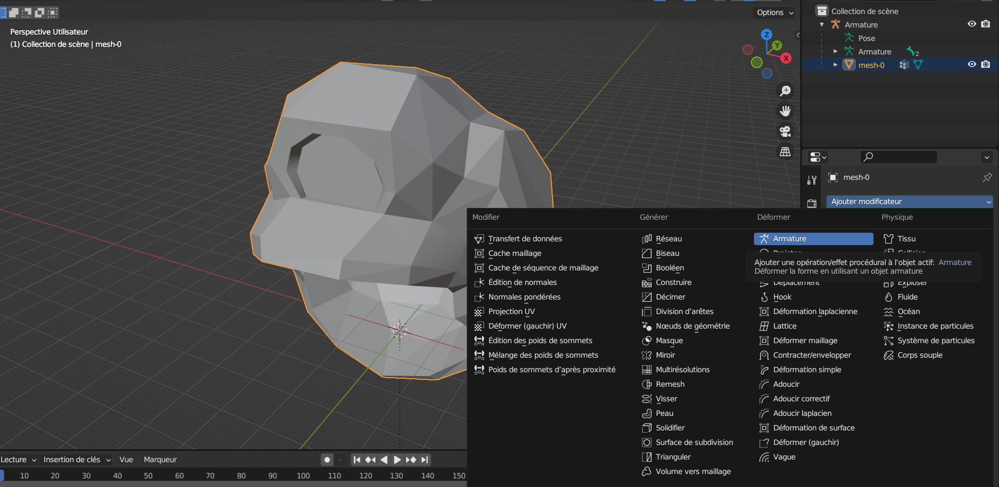
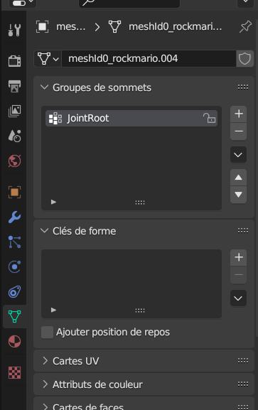
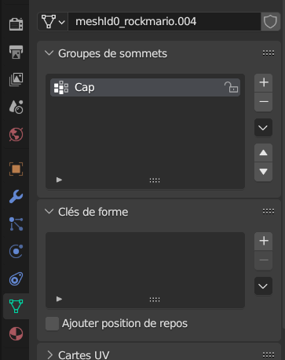
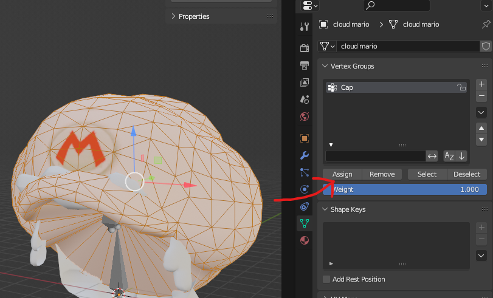
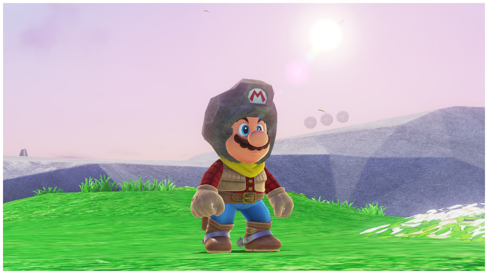

# replace skin model guide

**Do the same thing as the "replace skin model guide" but for the cap (only step 1 to step 3)**

So, here we want to replace the "*MarioSwimwearCap*" and the "*MarioSwimwearHead*" model, so we will have one model with the cap + the hair (for MarioSwimwearHead) and a model with the cap only (for MarioSwimwearCap). If you run the game with these models replaced, you will see this problem :

### Step 1 : Import the model of the cap (same manipulations for the two models of the cap)

*if you don't have a modificator on the cap model, add an armature modificator*

*when it's done, while having the cap selected, add a vertex group, name it "JointRoot" for the model which contains only the cap (MarioSwimwearCap)*

*and for the other one who contains the cap + the hair (MarioSwimwearHead), name it "Cap"*

### Step 2 : Then go into "edit mode" and select all the vertices in the cap with the A key. While they are selected click "assign"

and then, all should be good !(if you want to modify the eyes position and rotation : In MarioSwimwearHead there's a file you need to edit called *InitPartsFixInfo.byml*. Go to LocalTrans and probably change the X value)

